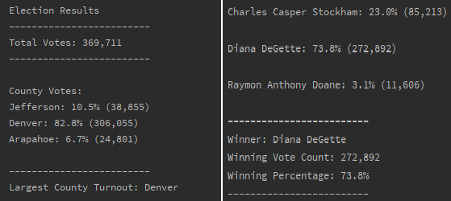

# Election-Analysis

## Overview of Election Audit
In the exercises building up to this challenge, we were instructed to create code that would calculate total number of votes cast, complete list of candidates participating, votes and percentage of votes each candidate received, and determine the winner of the election based on popular vote. In this challenge, we were instructed to add additional functionality to the existing code, including voter turnout from each county, percentage of each votes from each county, and county with highest turnout.  

## Election-Audit Results
Shown below is the terminal output for the election results:

- The total number of votes cast in this election was 369,711
- Out of the total number of votes, Jefferson county provided 38,855 (10.5%), Denver county provided 306,055 (82.8%), and Arapahoe provided 24,801 (6.7%)
- Denver county had the largest number of votes
- Candidate vote breakdown is as follows:
  - Charles Casper Stockham: 85,213 (23.0%)
  - Diana DeGette: 272,892 (73.8%)
  - Raymon Anthony Doane: 11,606 (3.1%)
 - Diana DeGette was the winner of the elction, receiving 272,892 or 73.8% of the total votes

Overview of Election Audit: Explain the purpose of this election audit analysis.

Election-Audit Results: Using a bulleted list, address the following election outcomes. Use images or examples of your code as support where necessary.

How many votes were cast in this congressional election?
Provide a breakdown of the number of votes and the percentage of total votes for each county in the precinct.
Which county had the largest number of votes?
Provide a breakdown of the number of votes and the percentage of the total votes each candidate received.
Which candidate won the election, what was their vote count, and what was their percentage of the total votes?
Election-Audit Summary: In a summary statement, provide a business proposal to the election commission on how this script can be used—with some modifications—for any election. Give at least two examples of how this script can be modified to be used for other elections.
